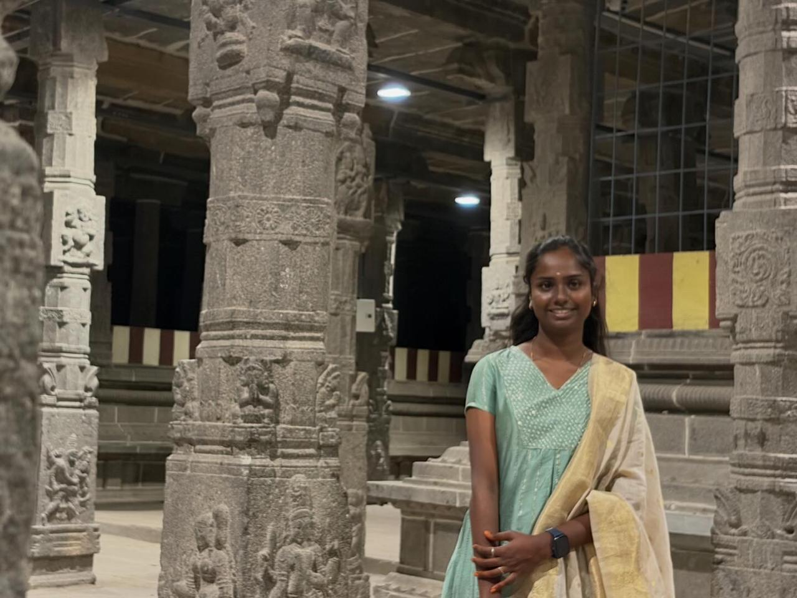

# Ex01 Portfolio
## Date:24-07-202

## AIM
To create a Portfolio using HTML and CSS.

## ALGORITHM
### STEP 1
Create an HTML file (index.html)

### STEP 2
Create a CSS file (style.css)

### STEP 3
Include a navigation bar with links to different sections.

### STEP 4
Add structured sections for introduction, about, projects, and contact details.

### STEP 5
Define global styles for fonts, colors, and layout.

### STEP 6
Style the header, navigation bar, and sections.

### STEP 7
Use Flexbox or CSS Grid for layout design.

### STEP 8
Add hover effects and transitions for interactivity.

### STEP 9
Add Images and Media.

### STEP 10
Use optimized images for a professional look.

### STEP 11
Open the HTML file in a browser to check layout and functionality.

### STEP 12
Fix styling issues and refine content placement.

### STEP 13
Deploy the Portfolio.

### STEP 14
Upload to GitHub Pages for free hosting.

## PROGRAM
index.html
```
<!DOCTYPE html>
<html lang="en">

<head>
    <meta charset="UTF-8">
    <meta name="viewport" content="width=device-width, initial-scale=1.0">
    <title>Vaishnavi D | Portfolio</title>

    <link rel="stylesheet" href="style.css">

    <link href="https://fonts.googleapis.com/css2?family=Poppins:wght@300;400;500;600;700&display=swap"
        rel="stylesheet">

    <script src="script.js" defer></script>
</head>

<body>

    <header>

        <div class="logo">💜 Vaishnavi</div>

        <nav>

            <a href="#home">Home</a>

            <a href="#about">About</a>

            <a href="#skills">Skills</a>

            <a href="#projects">Projects</a>

            <a href="#contact">Contact</a>

        </nav>

    </header>

    <!-- Hero -->

    <section class="hero" id="home">

        <div class="content">

            <h3>Hello 👋 I'm</h3>

            <h1>Vaishnavi D</h1>

            <h2>B.Tech Information Technology Student</h2>

            <p>

                Passionate about Web Development, Cybersecurity,
                Programming and creating beautiful websites.

            </p>

            <div class="buttons">

                <a href="#projects" class="btn">View Projects</a>

                <a href="#contact" class="btn2">Contact Me</a>

            </div>

        </div>

        <div class="image">

            

        </div>

    </section>

    <!-- About -->

    <section id="about">

        <h2>About Me</h2>

        <div class="glass">

            <p>

                Hello! I'm <b>Vaishnavi D</b>, a third-year B.Tech Information
                Technology student at Saveetha Engineering College.

                I love learning new technologies and building modern,
                responsive websites.

                My interests include Web Development, Cybersecurity,
                Python Programming and UI Design.

            </p>

        </div>

    </section>

    <!-- Skills -->

    <section id="skills">

        <h2>My Skills</h2>

        <div class="skills">

            <div class="skill">🌐 HTML</div>

            <div class="skill">🎨 CSS</div>

            <div class="skill">⚡ JavaScript</div>

            <div class="skill">🐍 Python</div>

            <div class="skill">💻 C Programming</div>

            <div class="skill">☕ Java</div>

            <div class="skill">🔐 Cybersecurity</div>

            <div class="skill">🐙 GitHub</div>

        </div>

    </section>

    <!-- Projects -->

    <section id="projects">

        <h2>Projects</h2>

        <div class="project-container">

            <div class="project-card">

                <h3>🌐 Portfolio Website</h3>

                <p>

                    Developed a responsive personal portfolio using
                    HTML, CSS and JavaScript.

                </p>

            </div>

            <div class="project-card">

                <h3>🎓 Student Management System</h3>

                <p>

                    A Python application to manage student records
                    efficiently.

                </p>

            </div>

            <div class="project-card">

                <h3>🛡 Cybersecurity Awareness</h3>

                <p>

                    A website to educate users about online security
                    and cyber safety.

                </p>

            </div>

        </div>

    </section>

    <!-- Contact -->

    <section id="contact">

        <h2>Contact Me</h2>

        <div class="contact-box">

            <p>📧 vaishnavidhanasekaran7@gmail.com</p>

            <p>🐙 github.com/Vaishnavi7862</p>

            <p>📍 Tamil Nadu, India</p>

        </div>

    </section>

    <footer>

        ❤️ Designed by Vaishnavi D | 2026

    </footer>

</body>

</html>
```
style.css
```
*{
    margin:0;
    padding:0;
    box-sizing:border-box;
    font-family:'Poppins',sans-serif;
    scroll-behavior:smooth;
}

body{
    background:linear-gradient(135deg,#6a11cb,#2575fc);
    color:#fff;
}

/* Header */

header{
    width:100%;
    padding:20px 8%;
    display:flex;
    justify-content:space-between;
    align-items:center;
    position:fixed;
    top:0;
    left:0;
    backdrop-filter:blur(15px);
    background:rgba(255,255,255,.08);
    z-index:1000;
}

.logo{
    font-size:30px;
    font-weight:700;
}

nav a{
    color:white;
    text-decoration:none;
    margin-left:30px;
    font-weight:500;
    transition:.3s;
}

nav a:hover{
    color:#FFD93D;
}

/* Hero */

.hero{
    min-height:100vh;
    display:flex;
    justify-content:space-around;
    align-items:center;
    padding:120px 10%;
    flex-wrap:wrap;
}

.content{
    max-width:600px;
}

.content h3{
    font-size:28px;
}

.content h1{
    font-size:65px;
    margin:10px 0;
}

.content h2{
    color:#FFE66D;
    margin-bottom:20px;
}

.content p{
    font-size:18px;
    line-height:1.8;
}

.buttons{
    margin-top:35px;
}

.btn,
.btn2{
    text-decoration:none;
    padding:14px 32px;
    border-radius:40px;
    margin-right:15px;
    font-weight:600;
    transition:.4s;
}

.btn{
    background:#fff;
    color:#2575fc;
}

.btn:hover{
    background:#FFD93D;
    transform:translateY(-5px);
}

.btn2{
    border:2px solid white;
    color:white;
}

.btn2:hover{
    background:white;
    color:#2575fc;
}

.image img{
    width:340px;
    height:340px;
    border-radius:50%;
    object-fit:cover;
    border:8px solid white;
    box-shadow:0 0 40px rgba(255,255,255,.5);
    animation:float 3s ease-in-out infinite;
}

@keyframes float{

    0%{
        transform:translateY(0);
    }

    50%{
        transform:translateY(-15px);
    }

    100%{
        transform:translateY(0);
    }

}

/* Sections */

section{
    padding:80px 10%;
}

section h2{
    text-align:center;
    font-size:40px;
    margin-bottom:40px;
}

/* About */

.glass{

    background:rgba(255,255,255,.12);

    padding:35px;

    border-radius:20px;

    backdrop-filter:blur(20px);

    box-shadow:0 10px 30px rgba(0,0,0,.2);

    line-height:2;

    font-size:18px;

}

/* Skills */

.skills{

    display:grid;

    grid-template-columns:repeat(auto-fit,minmax(180px,1fr));

    gap:25px;

}

.skill{

    padding:25px;

    text-align:center;

    background:white;

    color:#2575fc;

    border-radius:20px;

    font-weight:bold;

    font-size:20px;

    transition:.4s;

}

.skill:hover{

    transform:translateY(-10px) scale(1.05);

    background:#FFD93D;

}

/* Projects */

.project-container{

    display:grid;

    grid-template-columns:repeat(auto-fit,minmax(260px,1fr));

    gap:30px;

}

.project-card{

    background:rgba(255,255,255,.12);

    padding:30px;

    border-radius:20px;

    backdrop-filter:blur(15px);

    transition:.4s;

}

.project-card:hover{

    transform:translateY(-10px);

    box-shadow:0 15px 35px rgba(0,0,0,.3);

}

.project-card h3{

    margin-bottom:15px;

    color:#FFE66D;

}

/* Contact */

.contact-box{

    background:rgba(255,255,255,.12);

    padding:35px;

    border-radius:20px;

    text-align:center;

    line-height:2.2;

    font-size:20px;

}

/* Footer */

footer{

    text-align:center;

    padding:30px;

    background:rgba(0,0,0,.2);

    font-size:18px;

}

/* Mobile */

@media(max-width:900px){

header{

    flex-direction:column;

}

nav{

    margin-top:15px;

}

nav a{

    margin:10px;

}

.hero{

    text-align:center;

}

.content h1{

    font-size:45px;

}

.image img{

    width:250px;

    height:250px;

    margin-top:40px;

}

}
```
## OUTPUT
.png>)

## RESULT
The program for creating Portfolio using HTML and CSS is executed successfully.
